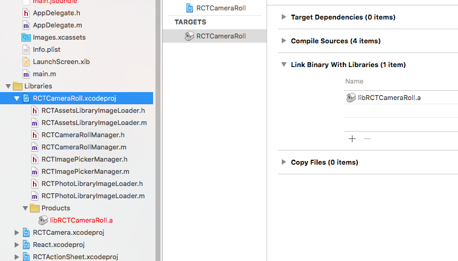

# 语法速查

>各功能模块介绍以及部分API见[Wiki](https://github.com/XingdaLee/Box/wiki)

##掉坑总结

1、npm只使用电脑自带‘终端’ 绝对不在使用第三方工具;

2、npm时必须系统全局翻墙;

3、遇到Xcode编译错误时，如果怀疑是npm下载数据不完整的问题，必须 sudo npm cache clean;

##报错信息与解决方法
* 类似于这样循环时报错（/box/ShoppingCart）：Each child in an array or iterator should have a unique "key" prop.
  Check the render method of `List`. See https://fb.me/react-warning-keys for more information.

>只要在<View style={styles.row} key={i}>中加上key={i}就可以了

* CameraRoll Cannot read property 'getPhotos' of undefined

>在libraries上右击添加node_modules/react-native/CameraRoll/RCTCameraRoll.xcodeproj，并点击RCTCameraRoll.xcodeproj 选择'Build Phases'，点击Link Binary With libraries添加 libRCTCameraRoll.a ,重启模拟器即可，相关资料：https://github.com/facebook/react-native/issues/4560

* Failed propType: Invalid props.style key `fontSize` supplied to `View`

>不可以给View组件fontSize属性，尽量把这个属性给Text
